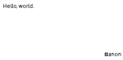

# Quotatron

> A Raspberry Pi Zero W e-paper appliance that displays rotating quotes
> and clean jokes, with 30 different 10-second wipe animations between
> each item.

## What it is

Quotatron rotates a curated corpus of famous-people quotes and clean
jokes on a Waveshare 2.13" e-paper HAT, displaying one item per minute
and transitioning between them with one of 30 randomly-chosen wipe
animations. Pixel polarity bounces every cycle to wear-level the e-ink
panel; a daily 03:00 deep-clean fully resets the display state.

## Hardware

- Raspberry Pi Zero W (1.1 or 2 W)
- Waveshare 2.13" e-paper HAT (V2, V3, or V4 — auto-selectable in config)
- microSD card (≥4 GB)
- Power supply (5V via micro-USB)

## Quick start (dev machine — laptop / desktop)

Requires [`uv`](https://docs.astral.sh/uv/) installed first
(`curl -LsSf https://astral.sh/uv/install.sh | sh`).

```bash
git clone https://github.com/<your>/quotatron.git
cd quotatron
make install            # uv sync
make preview            # web preview at http://127.0.0.1:8080
make test-unit          # 259 unit tests
```

> **On a Raspberry Pi, do NOT run `make install`** — it presumes `uv` is
> already on PATH. Use `./scripts/install.sh` instead (next section). It
> installs `uv` for you plus everything else.

## Deploying to a Pi

```bash
# 1. Convert your Windows WiFi profiles (optional, one-time)
uv run python scripts/wifi_to_wpa.py \
  --input "C:/path/to/Format/wifi_profiles" \
  --output wifi_profiles/wpa_supplicant.conf \
  --country PL

# 2. Flash an SD card (Linux/WSL)
./scripts/flash_sdcard.sh /dev/sdX path/to/raspios_lite.img

# 3. Boot the Pi, ssh in, and install:
ssh pi@quotatron.local
git clone https://github.com/<your>/quotatron.git
cd quotatron
./scripts/install.sh    # disables GUI, enables SPI, installs systemd unit
```

## Configuration

`config/quotatron.yaml` is the single source of runtime config. Key knobs:

- `cycle.quote_seconds` / `cycle.animation_seconds` — must sum to 60s/minute
- `content.quote_to_joke_ratio` — 0.7 = 70% quotes, 30% jokes
- `content.weights.quotes.<category>` — relative weight per quote category
- `display.rotation` — `landscape` (default) or `portrait`
- `display.driver` — `waveshare_2in13_v2`, `v3`, or `v4`
- `animations.blocklist` — list of animation names to never play
- `api_refresh.enabled` / `interval_minutes` — background API enrichment

## Animation gallery

All 30 wipe animations, generated by `make gallery`:

| | | | | |
|---|---|---|---|---|
| <br>**barn_door_wipe** | <br>**block_jitter** | <br>**column_rain** | <br>**concentric_circles** | <br>**conway_iterations** |
| <br>**dendritic** | <br>**diagonal_wipe** | <br>**diffusion_dissolve** | <br>**droplets** | <br>**expanding_rectangles** |
| <br>**falling_pixels** | <br>**flood_fill** | <br>**grid_stamp** | <br>**hilbert_fill** | <br>**ink_bleed** |
| <br>**line_shuffle** | <br>**lissajous** | <br>**matrix_rain** | <br>**ordered_dither_dissolve** | <br>**perlin_fade** |
| <br>**pure_noise** | <br>**radial_wipe** | <br>**random_pixel_dissolve** | <br>**ripple** | <br>**scanline_tear** |
| <br>**sine_sweep** | <br>**snake_fill** | <br>**spiral** | <br>**typewriter_overprint** | <br>**vine_grow** |

## Architecture

See [`docs/superpowers/specs/2026-04-26-quotatron-design.md`](docs/superpowers/specs/2026-04-26-quotatron-design.md) for the full design and [`docs/superpowers/plans/2026-04-27-quotatron.md`](docs/superpowers/plans/2026-04-27-quotatron.md) for the implementation plan.

Quick map:

```
src/quotatron/
├── config.py              YAML loader + pydantic models
├── content.py             Weighted picker with no-repeat window
├── render.py              Compose ContentItem -> 1-bit framebuffer
├── scheduler.py           Async main loop (cycle, polarity, deep-clean)
├── api_refresh.py         Background enrichment from 11 APIs
├── emergency_quotes.py    30 hardcoded fallback quotes
├── models.py              ContentItem + Polarity
├── display/               Display Protocol; Mock + Waveshare backends
├── animations/            30 plugin animations + auto-discovery
├── sources/               11 API source adapters
└── web_preview/           FastAPI + SSE preview UI
```

## Troubleshooting

- **Panel doesn't refresh:** `journalctl -u quotatron -f` to see live logs. Common causes: SPI not enabled (`sudo raspi-config`), wrong driver in `config/quotatron.yaml` (try `v2`/`v3`/`v4`), missing Waveshare vendored code (`scripts/install.sh` fetches it; if that failed, see WARN in install logs).
- **WiFi not connecting:** check `/etc/wpa_supplicant/wpa_supplicant.conf`. The XML→conf converter skips DPAPI-encrypted profiles silently — if your network is missing, re-export with `netsh wlan export profile name="X" key=clear`.
- **Sources rate-limited:** zenquotes throttles aggressively; the API refresh loop tolerates this and tries again next interval. `make verify-sources` shows current health.

## License

MIT — see [LICENSE](LICENSE).

## Credits

- e-Paper driver: [Waveshare](https://github.com/waveshare/e-Paper) (BSD-3)
- DejaVu Sans font: bundled with Pillow / `fonts-dejavu`
- API sources: quotable.io, ZenQuotes, type.fit, Stoic Quotes API, programming-quotes-api, Forismatic, icanhazdadjoke, JokeAPI.dev, official-joke-api, api.chucknorris.io, geek-jokes
- Quote attribution sources: public-domain corpora, manually verified per item
